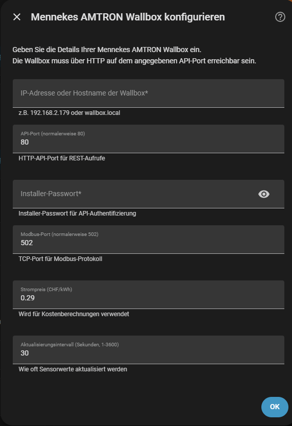

# Mennekes AMTRON Wallbox – Home Assistant Integration
### for AMTRON 4You 400 · 4You 500 · 4Business 600 · 4Business 700

[Deutsch (Schnellstart)](README.md) · [Manuelle Installation (Deutsch)](INSTALLATION_MANUELL.md) · **English (quick start)** · [Manual installation](INSTALLATION_MANUAL.md)

[](https://github.com/hacs/integration)
[](https://opensource.org/licenses/MIT)
[](https://github.com/nobelp/mennekes-amtron-ha/releases)

Integrates a Mennekes AMTRON wallbox into Home Assistant — set up entirely through the web
interface, no YAML files required.

> **All AMTRON 4You 400 and 500 as well as 4Business 600 and 700 communicate identically.** They
> use the same Modbus TCP register set, so this integration's compatibility covers the entire
> portfolio — including sub-variants such as the 4Business 730 or the 4You 550.

Features:

- **Real-time monitoring** via Modbus TCP: charging status, voltage, current, power, energy
- **Charging history** via REST API: sessions, costs — fetched on button press
- **System events** of the wallbox, filtered by level, event ID and free text
- **Vehicle mapping** by RFID inside the integration, no scripts or files
- **Control**: HEMS limit, safe current, charging pause, availability
- **Dashboard** with four tabs, shipped with the integration

> This page describes the **automated path**: HACS, configuration dialog, paste the dashboard —
> done. System events and RFID mapping are part of the integration as of version 2.1.0 and no
> longer need any YAML. The [manual installation](INSTALLATION_MANUAL.md) is only needed for
> ApexCharts diagrams, DLM cards and your own template sensors.

---

## Supported models

**AMTRON 4You 400/500** and **AMTRON 4Business 600/700** communicate identically — same Modbus TCP
register set on port 502, unit ID 1. The integration covers this entire portfolio, including
sub-variants such as the 4Business 730 or the 4You 550. Tested on an **AMTRON 4Business 730 11 C2**
with firmware 1.5.41.

Device requirement: protocol version **1.5** and Modbus TCP enabled. Register `2010` reports the
mode — `0` = off, `1` = read only, `2` = read and write. HEMS limit and safe current require `2`.

---

## Step 1: Install the integration

[](https://my.home-assistant.io/redirect/hacs_repository/?owner=nobelp&repository=mennekes-amtron-ha&category=integration)

1. Click the HACS button above, or in HACS add `https://github.com/nobelp/mennekes-amtron-ha` via
   **⋮ → Custom repositories** with category **Integration**
2. Search for **"Mennekes AMTRON"** and **download** it
3. **Restart** Home Assistant

---

## Step 2: Configure the wallbox

**Settings → Devices & Services → Add Integration → "Mennekes AMTRON"**



| Field | Meaning | Default |
|-------|---------|---------|
| **IP address or hostname** | Address of the wallbox on your network, e.g. `192.168.2.179` or `wallbox.local` | – (required) |
| **API port** | HTTP port used for the REST calls | `80` |
| **Installer password** | Password of the wallbox installer account | – (required) |
| **Modbus port** | TCP port of the Modbus protocol | `502` |
| **Electricity price (CHF/kWh)** | Basis for the cost calculation | `0.29` |
| **Update interval** | Interval of sensor updates in seconds (1–3600) | `30` |

After **OK** the integration creates one device with around 35 entities. It reads model, firmware
version and serial number from the wallbox itself — you do not need to select a model.

Electricity price and interval can be changed at any time via **Configure** on the integration
entry.

---

## Step 3: Set up the dashboard

The dashboard definition ships with the integration and is located after installation at
`/config/custom_components/mennekes_amtron/dashboards/`.

**3.1 Create the dashboard** — **Settings → Dashboards → "+ Add dashboard" →
"New dashboard from scratch"**:

| Field | Value |
|---|---|
| **Title** | `Wallbox` |
| **Icon** | `mdi:ev-station` |
| **URL** | `dashboard-wallbox` |
| **Show in sidebar** | enabled |

> The URL **must contain a hyphen** — Home Assistant rejects `wallbox` and `dashboard_wallbox` with
> *"Url path needs to contain a hyphen (-)"*.

**3.2 Get the YAML content** — what you need is the **file content** (250 lines of YAML), not the
file path. Two ways:

- **Without file access:** [open wallbox_dashboard_integration.yaml on GitHub](https://github.com/nobelp/mennekes-amtron-ha/blob/main/custom_components/mennekes_amtron/dashboards/wallbox_dashboard_integration.yaml)
  → **"Copy raw file"** icon above the file on the right → the whole content is on your clipboard
- **With file access to `/config`:** print the content and copy it
  ```bash
  cat /config/custom_components/mennekes_amtron/dashboards/wallbox_dashboard_integration.yaml
  ```

**3.3 Paste the content** — open the new dashboard, top right **pencil → ⋮ →
"Raw configuration editor"**, **select all existing text** (`Ctrl`+`A`) and **overwrite** it with
the copied YAML, then **Save**.

> **Common mistake:** do not type the path into the editor. If it contains a single line reading
> `/config/custom_components/...`, the path was pasted instead of the content.

Sanity check: the first line without a `#` must read
`title: Mennekes AMTRON Wallbox (Integration)`.

This variant references only entities the integration creates, so no card shows "entity not found".
No restart required.

**Result:** four tabs.

| Tab | URL | Content |
|---|---|---|
| Overview | `/dashboard-wallbox/wallbox-main` | Status, current or last charging session, energy, power, voltage & current, read-only limits |
| History | `/dashboard-wallbox/wallbox-history` | Totals, monthly table, consumption per vehicle, recent sessions, refresh button |
| System events | `/dashboard-wallbox/wallbox-systemlogs` | Wallbox event list filtered by level, event ID and free text |
| Configuration | `/dashboard-wallbox/wallbox-config` | RFID mapping, known vehicles, HEMS limit, safe current, timeout, charging pause, availability |

The second shipped file, `wallbox_dashboard.yaml`, is the **full version** with system-event
filters, DLM cards and vehicle mapping. It requires the
[manual installation](INSTALLATION_MANUAL.md); without it those cards stay empty. You can switch at
any time — just paste the other file's contents into the raw configuration editor, the URLs and the
sidebar entry stay the same.

---

## Mapping vehicles and fetching data

Both live in the **Configuration** tab — no files, no scripts:

1. **Pick an RFID** — the list fills itself from the charging history
2. Enter the **vehicle name**
3. Press **Assign** — the mapping is stored in the integration's options and appears immediately
   in the "Known vehicles" card together with consumption and cost

**Charging history and system events are fetched on button press only**, plus once when Home
Assistant starts. Every fetch costs a full login against the wallbox API, so a schedule would buy
nothing. The buttons:

| Button | Effect |
|---|---|
| **Refresh charging history** (Configuration and History tabs) | reloads sessions, costs and monthly totals |
| **Refresh** (System events tab) | reloads the event log |

While no data has been fetched yet, the tables show a hint instead of empty rows.

---

## If it does not work

**"No Modbus TCP connection … refused or immediately closed the session"**

The wallbox serves **only one Modbus TCP client at a time**. This message appears when another
client is already connected. Typical causes:

- a second Home Assistant instance polls the same wallbox
- an old YAML `modbus:` block in `configuration.yaml` holds the connection in parallel to the
  integration — the block is superseded by the integration and can be removed
- an energy manager or charge controller uses the HEMS interface

You can check this from any machine: if the wallbox accepts the TCP connection and closes it
immediately, the slot is taken.

**Sensors read 0 or "unavailable"** — enable Modbus TCP on the device (register `2010` must report
`1` or `2`).

**`systemStatus: UpdateInProgress` in the wallbox API** is not a reason for refused Modbus
connections — the wallbox keeps serving normally in that state. The value can persist and even
survives a reboot; it then points at a stuck firmware update and is a case for the manufacturer's
support.

**The availability switch does nothing** — register 124 is read-only in protocol version 1.5
according to the manufacturer documentation.

Further cases and the complete register reference are in the
[manual installation](INSTALLATION_MANUAL.md).

---

## Support & license

- **Issues**: [nobelp/mennekes-amtron-ha/issues](https://github.com/nobelp/mennekes-amtron-ha/issues)
- **Home Assistant Community**: [Discourse](https://discourse.home-assistant.io)
- **Change history**: [CHANGELOG.md](CHANGELOG.md)

MIT licence, see [LICENSE](LICENSE). Copyright © 2026 nobelp.
