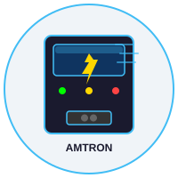

# 🔌 Mennekes AMTRON Wallbox – Home Assistant Integration



[](https://github.com/hacs/integration)
[](https://opensource.org/licenses/MIT)
[](https://github.com/nobelp/mennekes-amtron-ha/releases/latest)

Complete integration of a Mennekes AMTRON wallbox into Home Assistant:
- **Real-time monitoring** via Modbus TCP (voltage, current, power, charging status)
- **Charging sessions** via REST API (session history, vehicle assignment, costs)
- **Control** of HEMS limit, safe current, availability, charging pause
- **Dashboard** with ApexCharts bar chart, monthly table, session list

---

## 📦 Installation

### Option 1: HACS (Recommended)

[](https://my.home-assistant.io/redirect/hacs_repository/?owner=nobelp&repository=mennekes-amtron-ha&category=integration)

1. Click the HACS button above or navigate to **HACS → Integrations**
2. Search for **"Mennekes AMTRON"**
3. Click **"Download"** and follow the instructions

### Option 2: Manual

```bash
# Clone the repository
git clone https://github.com/nobelp/mennekes-amtron-ha.git ~/HA_Menneckes

# Copy the files to Home Assistant (see "Full Fresh Installation" below)
```

---

## Overview: How Everything Connects

```
┌─────────────────────┐     Modbus TCP :502      ┌────────────────────┐
│  Home Assistant     │ ◄──────────────────────► │  Mennekes Wallbox  │
│  192.x.x.x          │                           │  192.x.x.x         │
│                     │     REST API :80          │                    │
│  (Docker on NAS)    │ ◄──────────────────────► │  (WiFi + GSM)      │
└─────────────────────┘                           └────────────────────┘
        │
        │ reads/writes
        ▼
  /config/wallbox_sessions.json    (charging sessions + monthly data)
  /config/wallbox_vehicles.json    (RFID → vehicle name mapping)
  /config/wallbox_config.json      (electricity price CHF/kWh)
  /config/wallbox_fetch.log        (fetch log for debugging)
```

### Data Paths & Frequency

| Source | Frequency | Target |
|--------|-----------|--------|
| Modbus TCP registers | every 30s | HA sensors (voltage, current, power…) |
| REST API `/ChargingTransactionHistory` | hourly + HA start | `/config/wallbox_sessions.json` |
| `wallbox_sessions.json` | hourly (cat) | `sensor.wallbox_sessions` |
| `sensor.wallbox_sessions` attributes | live (template) | cost sensors, dashboard |
| Dashboard (ApexCharts) | on page load | bar chart from `monthly_summary` |

---

## Hardware Configuration

- **Wallbox**: Mennekes AMTRON 4Business 730 11 C2
- **Firmware**: 1.5.41
- **Primary IP**: `192.x.x.x` (WiFi) — replace with your wallbox IP
- **Fallback IP**: `10.x.x.x` (GSM/mobile) — optional, only if available
- **Modbus**: Port 502, Slave ID 1
- **REST API**: Port 80 (HTTP)
- **HA Host**: `192.x.x.x:8123` (Docker on Synology NAS) — replace with your HA IP
- **HA Config**: `/config/` in the Home Assistant container

---

## 🚀 Installation & Setup

### Step 1: Install via HACS

1. **HACS → Custom Repositories**
   ```
   URL: https://github.com/nobelp/mennekes-amtron-ha
   Category: Integration
   ```

2. **Install Mennekes AMTRON**
   ```
   HACS → nobelp/mennekes-amtron-ha → Install
   ```

3. **Restart Home Assistant**
   ```
   Settings → System → System Options → Restart Home Assistant
   ```

### Step 2: Configure via UI (Recommended)

1. **Go to Integrations**
   ```
   Settings → Devices & Services → Integrations
   ```

2. **Create Integration**
   ```
   Click "Create Integration"
   Search for "Mennekes AMTRON"
   ```

3. **Fill in the Configuration Form**


**Required Fields:**
- **IP Address/Hostname:** Wallbox IP (e.g., 192.168.2.179 or wallbox.local)
- **API Port:** HTTP API Port (default: 80)
- **Installer Password:** Wallbox installer password
- **Modbus Port:** TCP Modbus Port (default: 502)
- **Electricity Price:** Price per kWh for cost calculation (default: 0.29 CHF)
- **Update Interval:** Sensor update frequency in seconds (default: 30)

4. **Click OK**
   ```
   Integration will validate connection and save configuration
   ```

---

## Environment Variables & Configuration

### Creating the .env File

The Python scripts require environment variables for the wallbox connection. Copy `.env.example` and adjust the values:

```bash
cp .env.example .env
```

Contents of `.env` (edit with your values):

```bash
# Mennekes Wallbox Configuration
WALLBOX_URL=http://192.x.x.x/api/v1    # Wallbox REST API URL (replace 192.x.x.x)
WALLBOX_PASS=SAMPLE_PASSWORD            # Installer password (replace with your password)

# Home Assistant (optional)
HA_HOST=192.x.x.x                       # Home Assistant host IP (replace with your HA IP)
HA_TOKEN=SAMPLE_API_TOKEN               # Long-lived access token (optional)
```

### Running Scripts with Environment Variables

```bash
# Using .env file
source .env
python3 python_scripts/fetch_charging_sessions.py

# Or pass directly
WALLBOX_PASS=your-password python3 python_scripts/fetch_charging_sessions.py

# Or as argument
python3 python_scripts/fetch_charging_sessions.py your-password
```

> **Important**: `.env` is ignored by Git and should **not** be checked into version control. Use `.env.example` for documentation purposes.

---

## Full Fresh Installation (Step by Step)

### 1. Copy Files from Workspace to HA

```bash
# Modbus configuration
cp modbus_wallbox.yaml /config/

# Helper entities
cp input_number_wallbox.yaml /config/
cp input_boolean_wallbox.yaml /config/
cp input_select_wallbox.yaml /config/
cp input_text_wallbox.yaml /config/

# Template sensors
cp templates/wallbox.yaml /config/templates/

# Python scripts
cp python_scripts/fetch_charging_sessions.py /config/python_scripts/
cp python_scripts/run_wallbox_fetch.sh /config/python_scripts/
cp python_scripts/write_vehicles.py /config/python_scripts/
cp python_scripts/assign_vehicle.py /config/python_scripts/

# Configuration files
cp wallbox_config.json /config/
cp wallbox_vehicles.json /config/

# Dashboard (generated by generate_dashboard.py)
python3 generate_dashboard.py > /config/.storage/lovelace.dashboard_wallbox
```

### 2. Update `configuration.yaml`

Add the following blocks to the existing `configuration.yaml`:

```yaml
# Recorder: exclude session sensor (large JSON attributes would
# freeze the frontend when ApexCharts fetches data)
recorder:
  exclude:
    entities:
      - sensor.wallbox_sessions

# Wallbox Modbus + Helpers
modbus: !include modbus_wallbox.yaml
input_number: !include input_number_wallbox.yaml
input_boolean: !include input_boolean_wallbox.yaml
input_select: !include input_select_wallbox.yaml
input_text: !include input_text_wallbox.yaml

# command_line sensors (HA 2022.11+ format – IMPORTANT: top-level, not under "sensor:")
command_line:
  - sensor:
      name: "Wallbox Software Version"
      unique_id: wallbox_software_version
      command: "curl -sf http://192.x.x.x/api/v1/PublicInfo | python3 -c \"import json,sys; d=json.load(sys.stdin); print(d['currentVersion'])\"" # Replace 192.x.x.x
      scan_interval: 3600

  - sensor:
      name: "Wallbox Sessions"
      unique_id: wallbox_sessions
      command: "cat /config/wallbox_sessions.json 2>/dev/null || echo '{\"count\":0,\"sessions\":[],\"total_kwh\":0,\"monthly_summary\":[],\"vehicles\":[],\"vehicle_totals\":{}}'"
      value_template: "{{ value_json.count | int(0) }}"
      json_attributes:
        - sessions
        - total_kwh
        - monthly_summary
        - vehicles
        - vehicle_totals
        - last_session_kwh
        - last_vehicle
      scan_interval: 3600

# Shell commands
shell_command:
  wallbox_fetch_sessions: "/bin/sh /config/python_scripts/run_wallbox_fetch.sh"

  wallbox_write_vehicles: >-
    RFID1="{{ states('input_text.wallbox_vehicle_1_rfid') }}"
    NAME1="{{ states('input_text.wallbox_vehicle_1_name') }}"
    RFID2="{{ states('input_text.wallbox_vehicle_2_rfid') }}"
    NAME2="{{ states('input_text.wallbox_vehicle_2_name') }}"
    RFID3="{{ states('input_text.wallbox_vehicle_3_rfid') }}"
    NAME3="{{ states('input_text.wallbox_vehicle_3_name') }}"
    RFID4="{{ states('input_text.wallbox_vehicle_4_rfid') }}"
    NAME4="{{ states('input_text.wallbox_vehicle_4_name') }}"
    python3 /config/python_scripts/write_vehicles.py

  wallbox_assign_vehicle: >-
    RFID_OPTION="{{ states('input_select.wallbox_rfid_selector') }}"
    VEHICLE_NAME="{{ states('input_text.wallbox_vehicle_name_new') }}"
    python3 /config/python_scripts/assign_vehicle.py
```

> **Important**: `recorder: exclude` prevents the sensor with its large JSON attributes from being written to the recorder database every hour. Without this setting, the frontend freezes when opening the History page (ApexCharts tries to load the complete entity history).

### 3. `automations.yaml` – Add Automation

```yaml
- id: '1780407000000'
  alias: Wallbox Update Charging Sessions
  description: Fetches sessions from the API (on startup and hourly), updates sensor and both dropdowns
  triggers:
  - event: start
    trigger: homeassistant
  - trigger: time_pattern
    hours: /1
  conditions: []
  actions:
  - action: shell_command.wallbox_fetch_sessions
    data: {}
  - action: homeassistant.update_entity
    target:
      entity_id: sensor.wallbox_sessions
  - delay: "00:00:04"
  - action: input_select.set_options
    target:
      entity_id: input_select.wallbox_month_filter
    data:
      options: >
        {{ ['All'] + ((state_attr('sensor.wallbox_sessions', 'monthly_summary') or []) | map(attribute='month_label') | list) }}
  - action: input_select.set_options
    target:
      entity_id: input_select.wallbox_rfid_selector
    data:
      options: >
        
        
        
        {{ ['Please select...'] + ns.opts }}
  mode: single
```

### 4. `scripts.yaml` – Add Scripts

```yaml
# Script 1: Assign RFID to a vehicle name (via dropdown)
wallbox_assign_vehicle:
  alias: "Assign Vehicle RFID"
  icon: mdi:card-account-details-outline
  mode: single
  sequence:
    - action: shell_command.wallbox_assign_vehicle
    - action: shell_command.wallbox_fetch_sessions
    - delay: "00:00:20"
    - action: homeassistant.update_entity
      target:
        entity_id: sensor.wallbox_sessions
    - delay: "00:00:04"
    - action: input_select.set_options
      target:
        entity_id: input_select.wallbox_month_filter
      data:
        options: >
          {{ ['All'] + ((state_attr('sensor.wallbox_sessions', 'monthly_summary') or []) | map(attribute='month_label') | list) }}
    - action: input_select.set_options
      target:
        entity_id: input_select.wallbox_rfid_selector
      data:
        options: >
          
          
          
          {{ ['Please select...'] + ns.opts }}

# Script 2: Save all 4 manual RFID slots + reload
wallbox_update_vehicles:
  alias: "Update Wallbox Vehicles & Data"
  icon: mdi:content-save-all
  mode: single
  sequence:
    - action: shell_command.wallbox_write_vehicles
    - action: shell_command.wallbox_fetch_sessions
    - delay: "00:00:20"
    - action: homeassistant.update_entity
      target:
        entity_id: sensor.wallbox_sessions
    - delay: "00:00:04"
    - action: input_select.set_options
      target:
        entity_id: input_select.wallbox_month_filter
      data:
        options: >
          {{ ['All'] + ((state_attr('sensor.wallbox_sessions', 'monthly_summary') or []) | map(attribute='month_label') | list) }}
    - action: input_select.set_options
      target:
        entity_id: input_select.wallbox_rfid_selector
      data:
        options: >
          
          
          
          {{ ['Please select...'] + ns.opts }}
```

### 5. Install HACS Card (if not already present)

The dashboard requires **apexcharts-card** (HACS → Frontend):
- HACS → Frontend → install `apexcharts-card` by RomRider
- Tested with version **2.2.3**

### 6. Generate Dashboard and Restart HA

```bash
# Generate dashboard JSON from Python script
cd /workspace/HA_Menneckes
python3 generate_dashboard.py > /config/.storage/lovelace.dashboard_wallbox

# Restart HA: Settings → System → Restart
```

After restart, the startup automation runs automatically:
- Charging sessions are fetched from the API (~20s)
- `sensor.wallbox_sessions` is updated
- RFID dropdown is populated with known vehicles
- Month filter dropdown receives all available months

---

## Dashboard – Tab Description

The wallbox dashboard is accessible at `/dashboard-wallbox/` and has three tabs.

### Tab 1: Overview

Real-time monitoring via Modbus TCP (updated every 30 seconds):

| Card | Content |
|------|---------|
| **Status** | Charging status, vehicle state, availability, plug lock, error codes, protocol version |
| **Current Charging Session** | Session energy, charge duration, signaled current, max. vehicle current |
| **Energy (kWh)** | Total energy + L1/L2/L3 individually |
| **Power (W)** | Total power + L1/L2/L3 individually |
| **Voltage & Current** | Voltage and current per phase |
| **Limits (read)** | HEMS current limit, operator limit, safe current, timeout – display only |
| **Dynamic Load Management** | DLM mode, slaves, available/applied current L1-L3 |

### Tab 2: History

Charging sessions from the REST API – panel view (full width):

```
┌──────────────────┬─────────────────────────────────────────┐
│ Statistics &     │  ApexCharts Bar Chart                    │
│ Filter (1/3)     │  Monthly consumption per vehicle (2/3)   │
├──────────────────┴─────────────────────────────────────────┤
│  Monthly table (kWh & CHF) – full width                     │
├─────────────────────────────────────────────────────────────┤
│  Charging sessions table – full width                        │
└─────────────────────────────────────────────────────────────┘
```

#### Statistics & Filter (left column, 1/3)

Shows overall summary and month filter:
- Number of charging sessions
- Total energy / total costs CHF
- Vehicle 1 total / Vehicle 2 total
- kWh & costs current month
- **Month filter dropdown** (`input_select.wallbox_month_filter`): Select a month → charging sessions table filters automatically

#### ApexCharts Bar Chart (right column, 2/3)

Stacked bar chart with one bar per month, broken down by vehicle (blue = vehicle 1, orange = vehicle 2).

**How it works:**
- Reads directly from `sensor.wallbox_sessions` → attribute `monthly_summary` via JavaScript `data_generator`
- **No HA statistics or long-term storage required** – all historical months from the session JSON are displayed immediately
- Time window: `graph_span: 13month` (last 13 months visible)
- New months appear automatically on the next hourly fetch

**Prerequisites:**
- apexcharts-card (HACS) installed, version ≥ 2.2.3
- `sensor.wallbox_sessions` must be excluded from the recorder (prevents freeze on the History API)

#### Monthly Table (full width)

Table of all months with exact kWh and CHF values:

| Month | Vehicle 1 kWh | CHF | Vehicle 2 kWh | CHF | Total kWh | CHF |
|-------|---------------|-----|---------------|-----|-----------|-----|
| May 2026 | 298.1 | 86.44 | 0.0 | 0.00 | 298.1 | 86.44 |
| April 2026 | 5.2 | 1.50 | 39.7 | 11.51 | 44.9 | 13.01 |

- Price comes from `input_number.wallbox_price_per_kwh` (adjustable live)
- Most recent months at the top

#### Charging Sessions Table (full width)

All charging sessions with date, vehicle, duration, kWh and CHF.

- Filtered by the month filter
- With "All": shows vehicle totals at the bottom
- With month selection: shows monthly totals per vehicle

### Tab 3: Configuration

All settings and vehicle management in one place.

#### Card: Assign Vehicle (Dropdown Method, Recommended)

The most convenient way to assign a vehicle name to an RFID tag:

1. **Select RFID** from the dropdown (`input_select.wallbox_rfid_selector`)
   - Format: `04A5F3D2CC1D90 — Kessi`
   - Automatically populated with all known RFIDs after each fetch
   - Shows the currently stored name (or "Unknown" if new)
2. **Enter new vehicle name** (`input_text.wallbox_vehicle_name_new`)
3. Press **"Assign & Reload Data"** button
   - Calls `script.wallbox_assign_vehicle`
   - Saves RFID → name in `wallbox_vehicles.json`
   - Re-fetches all sessions with the updated mapping
   - Updates both dropdowns

#### Card: Known Vehicles

Table of all RFIDs with their current name (determined from charging sessions).

#### Card: Wallbox Settings

All configuration parameters:

| Entity | Description |
|--------|-------------|
| `input_number.wallbox_price_per_kwh` | Electricity price CHF/kWh – changes all cost calculations immediately |
| `input_number.wallbox_hems_current_limit` | HEMS current limit (0 = pause, 6-16A) |
| `input_number.wallbox_safe_current` | Safe current (0-32A) |
| `input_number.wallbox_comm_timeout` | Communication timeout (1-300s) |
| `input_boolean.wallbox_cp_availability` | CP availability on/off |
| `input_boolean.wallbox_pause_charging` | Pause charging immediately |

#### Card: Manual RFID Management (4 Slots)

Older method with fixed slots for 4 vehicles. Button "Save all 4 slots & reload" writes all 4 entries to `wallbox_vehicles.json` at once.

---

## Configuration Files

### `wallbox_config.json` – Electricity Price for Fetch

```json
{
  "price_per_kwh_chf": 0.29
}
```

This price is embedded into session data by the fetch script. In the dashboard, the price can be adjusted live via `input_number.wallbox_price_per_kwh` – this takes effect immediately on all displays without a new fetch.

### `wallbox_vehicles.json` – RFID Mapping

```json
{
  "04A5F3D2CC1D90": "Kessi",
  "049D869A5A2294": "Tessi"
}
```

Read by `fetch_charging_sessions.py` to assign vehicle names to sessions. Can be edited via the dashboard (Configuration tab) or directly.

---

## How Is the Price Calculated?

The electricity price is configured in **two stages**:

1. **`wallbox_config.json`** (`price_per_kwh_chf: 0.29`) – read during fetch and embedded in `wallbox_sessions.json`
2. **`input_number.wallbox_price_per_kwh`** (default: 0.29) – live value for HA template sensors and dashboard

**Cost calculation**: `energy_kwh × price_per_kwh`

| Change... | Effect |
|-----------|--------|
| `input_number.wallbox_price_per_kwh` in dashboard | All cost displays update **immediately** (live) |
| Edit `wallbox_config.json` directly | Takes effect on the next fetch (hourly) on JSON data |

---

## When / How Is Data Updated?

### Automatically

| Time | What happens |
|------|-------------|
| HA start | Fetch automation starts, retrieves all sessions from API |
| Every full hour (`:00`) | Automation fetches sessions, updates sensor + both dropdowns |
| Every 30 seconds | Modbus polling: voltage, current, power, status |
| Every 60 minutes | Modbus: software version, total energy counter |

### Manually (Developer Tools → Services)

```yaml
# Trigger session fetch manually:
service: shell_command.wallbox_fetch_sessions

# Read sensor immediately:
service: homeassistant.update_entity
entity_id: sensor.wallbox_sessions

# Assign vehicle (use dropdown value):
service: script.wallbox_assign_vehicle

# Save all 4 slots + reload:
service: script.wallbox_update_vehicles
```

### Fetch Flow

```
Automation trigger (start or /1h)
    │
    ├── shell_command.wallbox_fetch_sessions
    │       └── run_wallbox_fetch.sh
    │               └── fetch_charging_sessions.py
    │                       ├── GET /api/v1/Nonce
    │                       ├── POST /api/v1/AuthManagement/login (Installer)
    │                       ├── GET /api/v1/ChargingTransactionHistory/ReadFromTo
    │                       │       from=2024-01-01, take=100, sorted in Python
    │                       ├── RFID → name via wallbox_vehicles.json
    │                       ├── cost calculation via wallbox_config.json
    │                       └── writes /config/wallbox_sessions.json
    │
    ├── homeassistant.update_entity(sensor.wallbox_sessions)
    │       └── cat /config/wallbox_sessions.json → sensor state + attributes
    │
    ├── delay 4s
    │
    ├── input_select.set_options(wallbox_month_filter)
    │       └── ['All', 'May 2026', 'April 2026', ...]
    │
    └── input_select.set_options(wallbox_rfid_selector)
            └── ['Please select...', '04A5F3D2CC1D90 — Kessi', '049D869A5A2294 — Tessi']
```

---

## Managing Vehicles (RFID → Name)

### Method 1: Dropdown (Recommended)

1. Dashboard → Tab **"Configuration"**
2. **"Select RFID"** – dropdown shows all known RFIDs with current name
3. **"New vehicle name"** – enter name (e.g. "Kessi")
4. Press **"Assign & Reload Data"**
5. After ~25 seconds: sessions show the new name, dropdown updated

### Method 2: Manual 4-Slot Management

1. Dashboard → Tab **"Configuration"** → Card "Manual RFID Management"
2. Enter RFID IDs and names in the fields
3. Press **"Save all 4 slots & reload"**

### Method 3: Directly via File

```bash
# SSH to NAS:
nano /volume1/docker/homeassistant/wallbox_vehicles.json

# Format:
{
  "04A5F3D2CC1D90": "Kessi",
  "049D869A5A2294": "Tessi",
  "NEW_RFID_ID": "New Vehicle"
}
```

Then trigger: `service: shell_command.wallbox_fetch_sessions`.

### Where Does the RFID Come From?

RFIDs appear automatically in:
- **Configuration tab** → "Known Vehicles" (from charging sessions)
- **RFID dropdown** (`wallbox_rfid_selector`) – updated after each fetch

Unknown RFIDs appear as `"RFID_CODE — RFID_CODE"` (RFID = name, not yet assigned).

---

## All HA Entities

### Modbus Sensors (directly from wallbox via Modbus)

| Entity | Description | Unit |
|--------|-------------|------|
| `sensor.meter_voltage_l1/l2/l3` | Voltage per phase | V |
| `sensor.wallbox_current_l1/l2/l3_ampere` | Current per phase | A |
| `sensor.meter_power_l1/l2/l3` | Power per phase | W |
| `sensor.wallbox_total_power` | Total power | W |
| `sensor.wallbox_energy_l1/l2/l3_kwh` | Energy per phase | kWh |
| `sensor.wallbox_total_energy_kwh` | Total energy | kWh |
| `sensor.wallbox_session_energy_kwh` | Session energy | kWh |
| `sensor.hems_current_limit` | HEMS limit (read) | A |
| `sensor.operator_current_limit` | Operator limit | A |
| `sensor.safe_current` | Safe current | A |
| `sensor.comm_timeout` | Timeout | s |
| `sensor.signaled_current` | Signaled current | A |
| `sensor.max_current_ev` | Max. EV current | A |
| `sensor.dlm_num_slaves_connected` | DLM slaves | – |
| `sensor.dlm_overall_current_available_l1/l2/l3` | DLM available | A |
| `sensor.dlm_overall_current_applied_l1/l2/l3` | DLM applied | A |

### Custom Component Sensors (mennekes_amtron integration v2.0.2)

| Entity | Description | Unit |
|--------|-------------|------|
| `sensor.mennekes_amtron_voltage_l1/l2/l3` | Meter Voltage per phase (v1.5) | V |
| `sensor.mennekes_amtron_current_l1/l2/l3` | Meter Current per phase (v1.5) | A |
| `sensor.mennekes_amtron_power_l1/l2/l3` | Meter Power per phase (v1.5) | W |
| `sensor.mennekes_amtron_total_power` | Total Power (v1.5) | W |
| `sensor.mennekes_amtron_energy_l1/l2/l3` | Meter Energy per phase (v1.5) | kWh |
| `sensor.mennekes_amtron_total_energy` | Total Energy (v1.5) | kWh |
| `sensor.mennekes_amtron_session_energy` | Session Energy (v1.5) | kWh |
| `sensor.mennekes_amtron_session_duration` | Charging Duration (v1.5) | s |
| `sensor.mennekes_amtron_signaled_current` | Signaled Current to EV (v1.5) | A |
| `sensor.mennekes_amtron_charging_status` | Charging Status (OCPP) | text |
| `sensor.mennekes_amtron_vehicle_state` | Vehicle State (A–E) | text |
| `sensor.mennekes_amtron_phase_switch_mode` | **Phase Switch Mode (NEW v1.5)** | text |
| `number.mennekes_amtron_hems_current_limit` | **HEMS Current Limit v1.5 (0.1A steps)** | A |
| `number.mennekes_amtron_safe_current` | Safe Current (fallback mode) | A |
| `number.mennekes_amtron_communication_timeout` | Communication Timeout | s |
| `switch.mennekes_amtron_cp_availability` | CP Availability | on/off |
| `switch.mennekes_amtron_pause_charging` | Pause Charging | on/off |

> **Note**: v1.5 protocol provides corrected Modbus register mapping and Phase Switch Mode support for 11kW devices with dynamic phase switching. Energy values use proper byte order (int32 parsing).

### Template Sensors (from `templates/wallbox.yaml`)

| Entity | Description |
|--------|-------------|
| `sensor.wallbox_charging_status` | Charging status (text: Charging, Ready, …) |
| `sensor.wallbox_vehicle_state_text` | Vehicle state A-E |
| `sensor.wallbox_cp_availability_text` | Availability |
| `sensor.wallbox_plug_lock_status_text` | Plug lock status |
| `sensor.wallbox_error_codes_text` | Error codes decoded |
| `sensor.wallbox_dlm_mode_text` | DLM mode text |
| `sensor.wallbox_charge_duration_formatted` | Charge duration hh:mm:ss |
| `sensor.wallbox_chargepoint_model` | Model string |

### Cost Sensors (from `templates/wallbox.yaml`)

| Entity | Description |
|--------|-------------|
| `sensor.wallbox_total_cost_chf` | Total costs CHF |
| `sensor.wallbox_kwh_current_month` | kWh in current month |
| `sensor.wallbox_cost_current_month_chf` | Costs in current month CHF |
| `sensor.wallbox_kwh_vehicle1_total` | Vehicle 1 total consumption kWh |
| `sensor.wallbox_kwh_vehicle2_total` | Vehicle 2 total consumption kWh |

### Sessions Sensor (`command_line`)

| Entity / Attribute | Description |
|-------------------|-------------|
| `sensor.wallbox_sessions` (state) | Number of charging sessions |
| `.attributes.sessions` | List of all sessions (max. 100) |
| `.attributes.monthly_summary` | Monthly summary with `by_vehicle` |
| `.attributes.vehicle_totals` | Total consumption per vehicle |
| `.attributes.total_kwh` | Total energy of all sessions |
| `.attributes.vehicles` | List of all vehicle names |
| `.attributes.last_session_kwh` | Last session kWh |
| `.attributes.last_vehicle` | Last vehicle |

> **Recorder exclusion**: `sensor.wallbox_sessions` is excluded from the HA recorder (`recorder: exclude`). Data is persisted in `wallbox_sessions.json`. No History tab in HA for this entity.

### Helper Entities

| Entity | Description |
|--------|-------------|
| `input_number.wallbox_price_per_kwh` | Electricity price CHF/kWh (live, 0.01–2.00) |
| `input_number.wallbox_hems_current_limit` | HEMS limit setting (0-16A) |
| `input_number.wallbox_safe_current` | Safe current setting (0-32A) |
| `input_number.wallbox_comm_timeout` | Comm timeout setting (1-300s) |
| `input_boolean.wallbox_cp_availability` | CP availability |
| `input_boolean.wallbox_pause_charging` | Pause charging |
| `input_select.wallbox_month_filter` | Month filter (auto-populated after fetch) |
| `input_select.wallbox_rfid_selector` | RFID dropdown for vehicle assignment (auto-populated) |
| `input_text.wallbox_vehicle_1-4_rfid` | RFID card slots (manual method) |
| `input_text.wallbox_vehicle_1-4_name` | Vehicle name slots (manual method) |
| `input_text.wallbox_vehicle_name_new` | New name for dropdown assignment |

---

## API Authentication (Wallbox REST)

```
1. GET  /api/v1/Nonce?nocache=<timestamp>        → Nonce string
2. POST /api/v1/AuthManagement/login              → Bearer token
   Header: X-Nonce: <nonce>
   Body:   {"username": "Installer", "password": "<password>"}
3. GET  /api/v1/ChargingTransactionHistory/ReadFromTo
   Header: Authorization: Bearer <token>
   Params: skip=0&take=100&from=2024-01-01T00:00:00.000Z&to=<now>
```

**Important API pitfalls:**

| Problem | Cause | Solution |
|---------|-------|----------|
| HTTP 400 on login | Wrong username | Must be exactly `"Installer"` (capital I) |
| HTTP 400 on history | `orderBy` parameter | Remove parameter, sort in Python |
| Timeout on history | `from=2020-01-01` | Always use `from=2024-01-01` – 2020 has test sessions |
| Password error | Special characters | Always use single quotes in shell: `'...'` |

### Password

The wallbox password is stored in `/config/python_scripts/run_wallbox_fetch.sh`:
```sh
#!/bin/sh
WALLBOX_PASS='<your-password>' python3 /config/python_scripts/fetch_charging_sessions.py > /config/wallbox_fetch.log 2>&1
```

---

## Modbus Register Reference

### Read-Only

| Register | Description | Unit |
|----------|-------------|------|
| 100-101 | Firmware version | ASCII |
| 104 | CP status (OCPP) | enum 0-9 |
| 105-108 | Error codes 1-4 | bitmask |
| 120-121 | Protocol version | ASCII |
| 122 | Vehicle state | enum 1-5 |
| 142-151 | Chargepoint model | ASCII |
| 200 | Voltage L1 | V |
| 201 | Voltage L2 | V |
| 202 | Voltage L3 | V |
| 206 | Current L1 | mA |
| 207 | Current L2 | mA |
| 208 | Current L3 | mA |
| 212 | Power L1 | W |
| 213 | Power L2 | W |
| 214 | Power L3 | W |
| 215 | Total power | W |
| 216 | Energy L1 | Wh |
| 217 | Energy L2 | Wh |
| 218 | Energy L3 | Wh |
| 219 | Total energy | Wh |
| 705 | Session energy | Wh |
| 706-707 | Session duration | s (32bit) |
| 720 | Signaled current | A |
| 722 | Max. EV current | A |

### Read/Write

| Register | Description | Range |
|----------|-------------|-------|
| 124 | CP availability | 0=unavailable, 1=available |
| 131 | Safe current | 0-32 A |
| 132 | Comm timeout | 1-300 s |
| 1000 | HEMS current limit | 0=pause, 6-16 A |

---

## Fallback: Mobile Network Access

If the wallbox is not reachable via WiFi:
- **Mobile IP**: `10.x.x.x` (GSM backup, via SIM card) — if available

Change the `host` in `modbus_wallbox.yaml`:
```yaml
hub:
  - name: "Mennekes AMTRON Wallbox"
    host: 10.x.x.x  # ← fallback IP, replace with the actual IP
    port: 502
```

Or use environment variables in `.env`:
```bash
WALLBOX_URL=http://10.x.x.x/api/v1
```

---

## Troubleshooting

### History Page Freezes the Browser

**Cause**: `sensor.wallbox_sessions` is not excluded from the recorder. apexcharts-card loads the complete entity history when opened (hourly updates × large JSON attributes = MB of data).

**Fix**: Exclude the sensor in `configuration.yaml` under `recorder:`:
```yaml
recorder:
  exclude:
    entities:
      - sensor.wallbox_sessions
```
Then restart HA.

### ApexCharts Shows Empty Chart / No Bars

Possible causes:
1. `apexcharts-card` not installed (HACS → Frontend)
2. `sensor.wallbox_sessions` has no data yet → wait for fetch to complete
3. Wrong chart type: must be `type: column` on the series (not `chart_type: bar` at card level – not supported in v2.2.3)
4. `graph_span` missing → data outside the visible time window

### ApexCharts Shows "Configuration Error"

`apexcharts-card v2.2.3` only supports `chart_type: line/scatter/pie/donut/radialBar` at card level. For bars: set `type: column` on each series, no `chart_type: bar`.

### sensor.wallbox_sessions Shows 0 or Doesn't Appear

```bash
# Check JSON file
cat /volume1/docker/homeassistant/wallbox_sessions.json | python3 -m json.tool

# View fetch log
cat /volume1/docker/homeassistant/wallbox_fetch.log

# Check sensor format: must be top-level command_line
# CORRECT:
command_line:
  - sensor:
      name: "Wallbox Sessions"
# WRONG (deprecated since HA 2022.11):
sensor:
  - platform: command_line
```

### Sessions Show "Unknown" as Vehicle

1. Dashboard → Tab "Configuration" → "Known Vehicles"
2. Read RFID from table
3. Select the corresponding RFID in the "Select RFID" dropdown
4. Enter name → press "Assign & Reload Data"

### Wallbox Not Reachable

```bash
# Check WiFi connection (replace 192.x.x.x with your wallbox IP)
ping 192.x.x.x
curl -sf http://192.x.x.x/api/v1/PublicInfo

# Check Modbus port
nc -zv 192.x.x.x 502

# Try GSM fallback (if configured, replace 10.x.x.x)
ping 10.x.x.x
```

### Wallbox API Returns HTTP 400

- Username must be exactly `"Installer"` (capital I)
- Remove `orderBy` parameter
- Use `from=2024-01-01` (not 2020 → timeout from test sessions)

---

## Known RFID Cards

| RFID | Vehicle |
|------|---------|
| `04A5F3D2CC1D90` | Kessi (Tesla) |
| `049D869A5A2294` | Tessi (Tesla) |

---

## File Overview

```
/workspace/HA_Menneckes/                    (source code / development)
├── README.md                               ← This file
├── generate_dashboard.py                   ← Dashboard generator (Python → JSON)
├── modbus_wallbox.yaml                     ← Modbus TCP register map
├── input_number_wallbox.yaml               ← Numeric input helpers
├── input_boolean_wallbox.yaml              ← Boolean input helpers
├── input_select_wallbox.yaml               ← Dropdown helpers (month, RFID)
├── input_text_wallbox.yaml                 ← Text helpers (vehicle names, RFIDs)
├── templates/
│   └── wallbox.yaml                        ← Template sensors
├── dashboards/
│   └── wallbox_dashboard.yaml              ← Lovelace dashboard (generated)
├── python_scripts/
│   ├── fetch_charging_sessions.py          ← REST API fetch (main script)
│   ├── run_wallbox_fetch.sh                ← Wrapper (password not in repo)
│   ├── write_vehicles.py                   ← Writes vehicles.json (4-slot method)
│   └── assign_vehicle.py                   ← Writes vehicles.json (dropdown method)
├── VERSION
├── LICENSE
└── .gitignore

/workspace/homeassistant/                   (HA config, live = /config/ in container)
├── configuration.yaml                      ← Main config (recorder, command_line, shell_command)
├── automations.yaml                        ← Wallbox fetch automation
├── scripts.yaml                            ← wallbox_assign_vehicle + wallbox_update_vehicles
├── modbus_wallbox.yaml
├── input_number_wallbox.yaml
├── input_boolean_wallbox.yaml
├── input_select_wallbox.yaml               ← wallbox_month_filter + wallbox_rfid_selector
├── input_text_wallbox.yaml                 ← vehicle_1-4 + vehicle_name_new
├── wallbox_config.json
├── wallbox_vehicles.json
├── wallbox_sessions.json                   ← Generated by fetch, do not edit manually
├── wallbox_fetch.log                       ← Fetch log (debug)
├── templates/
│   └── wallbox.yaml                        ← Template sensors + cost sensors
├── python_scripts/
│   ├── fetch_charging_sessions.py
│   ├── run_wallbox_fetch.sh
│   ├── write_vehicles.py
│   └── assign_vehicle.py
└── .storage/
    └── lovelace.dashboard_wallbox          ← Lovelace dashboard JSON
```

### Regenerating the Dashboard

When `generate_dashboard.py` is changed:
```bash
cd /workspace/HA_Menneckes
python3 generate_dashboard.py > /workspace/homeassistant/.storage/lovelace.dashboard_wallbox
# No HA restart needed – browser Shift+F5 is sufficient
```

---

## 📝 Changelog & Versioning

See [CHANGELOG.md](CHANGELOG.md) for complete change history.

**Versioning**: Semantic Versioning (MAJOR.MINOR.PATCH)
- `MAJOR`: Breaking changes
- `MINOR`: New features
- `PATCH`: Bug fixes

---

## 📜 License

MIT License – See [LICENSE](LICENSE) for details.

Copyright © 2026 nobelp
